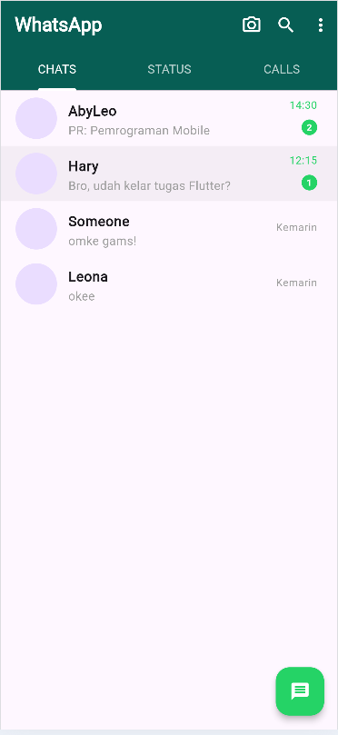
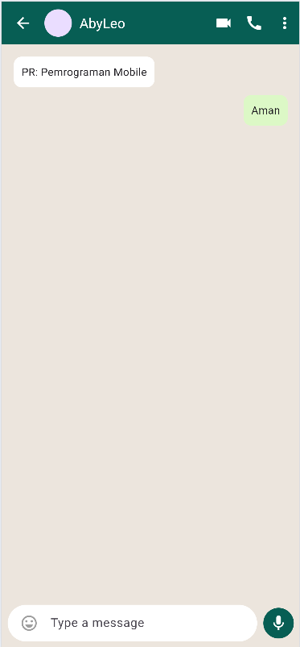
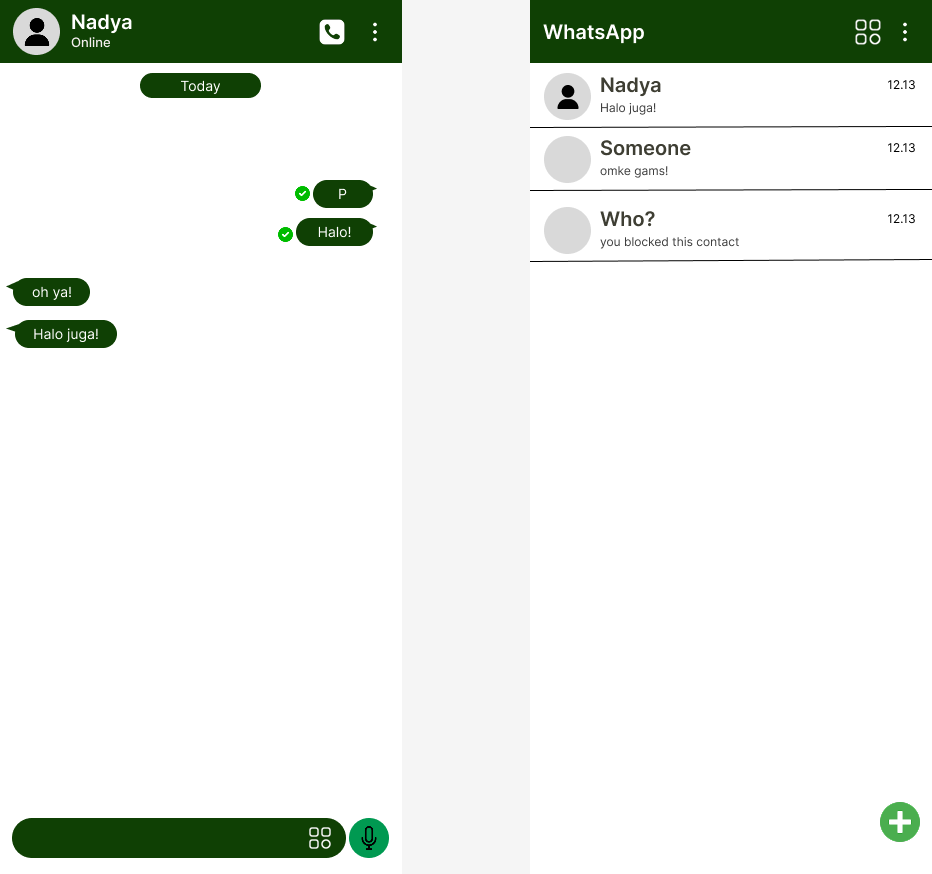

# Tugas UI/UX Flutter — WhatsApp

## Identitas
- **Nama:** Mochammad Syahid Fariz Abqari
- **NIM:** 2455201110009
- **Pilihan:** A

## Deskripsi Singkat
Proyek ini mereplikasi tampilan antarmuka (UI) dari aplikasi [NAMA APLIKASI]. Halaman utama yang dibuat berfokus pada struktur layout menggunakan widget dasar Flutter tanpa fungsi logika backend.

## Widget yang Digunakan
- **Scaffold** — Sebagai kerangka dasar halaman aplikasi.
- **AppBar** — Menampilkan navigasi atas dan judul aplikasi.
- **ListView / GridView** — Membuat daftar elemen yang bisa di-scroll.
- **Container / Padding** — Mengatur jarak dan ruang antar elemen.
- **Row / Column** — Menyusun elemen secara horizontal dan vertikal.
- **CircleAvatar** — Menampilkan foto profil pengguna.

## Screenshot

## Wireframe

## Kesulitan yang Ditemui
- Kesulitan saat memahami struktur List dan penempatan icon, namun teratasi dengan memecah widget menjadi komponen terpisah